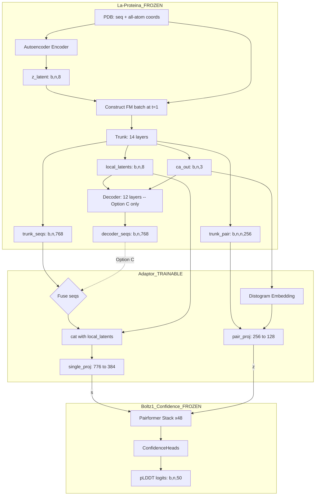

# Quality-Graft: Architecture Plan

## Overview

**Goal**: Train an attention adaptor that bridges La-Proteina's representations to Boltz1's confidence head, enabling pLDDT prediction from La-Proteina features.

**Key Insight**: La-Proteina (frozen: autoencoder + trunk + optional decoder) -> Adaptor Layers (trainable) -> Boltz1 Confidence Head (frozen) -> pLDDT scores

**Two-Phase Approach**:
- **Option A (Baseline)**: Trunk representations only (seqs + pair_rep + local_latents) -> adaptor -> confidence head
- **Option C (Hybrid)**: Trunk + decoder representations (trunk pair_rep + fused trunk+decoder seqs + local_latents) -> adaptor -> confidence head

The architecture supports smooth transition from A to C by keeping the adaptor modular.

---

## 1. Dimension Analysis

### La-Proteina Components

| Representation | Trunk (160M, 14 layers) | Decoder (12 layers) | Autoencoder Encoder (12 layers) |
|---|---|---|---|
| Single/Seq repr | `token_dim = 768` | `token_dim = 768` | `token_dim = 768` |
| Pair repr | `pair_repr_dim = 256` (updated during trunk) | `pair_repr_dim = 256` (static, no updates) | `pair_repr_dim = 256` |
| Local latent | `latent_dim = 8` (output head) | N/A (input) | `latent_z_dim = 8` (output) |
| Conditioning | `dim_cond = 256` | `dim_cond = 128` | `dim_cond = 128` |
| Attention heads | `nheads = 12` | `nheads = 12` | `nheads = 12` |

### Boltz1 Confidence Module

| Representation | Dimension |
|---|---|
| Single repr (`token_s`) | 384 |
| Pair repr (`token_z`) | 128 |
| Atom single (`atom_s`) | 128 |
| Atom pair (`atom_z`) | 16 |

### Adaptor Dimension Mappings

| Mapping | Input Dim | Output Dim | Notes |
|---|---|---|---|
| Single projection | 768 + 8 = 776 | 384 | seqs + local_latents concatenated |
| Pair projection | 256 | 128 | Trunk pair_rep only (both modes) |
| Decoder fusion (Option C only) | 768 | 768 | Gated addition into trunk seqs |

---

## 2. Data Flow Architecture

### La-Proteina Representation Extraction Pipeline

Both options share the same upstream pipeline to extract representations from a protein structure:

```
Input: PDB structure (sequence + all-atom 3D coordinates)
                    |
                    v
    +--------------------------+
    | Autoencoder Encoder      |  FROZEN (12 layers, 768-dim)
    | Input: all-atom coords,  |
    |        residue types,    |
    |        coord masks       |
    +-----------+--------------+
                |
                v
         z_latent [b,n,8]   (per-residue latent encoding sequence + sidechain geometry)
                |
                v
    Construct flow matching batch:
      t = 1.0 (or 0.999)
      x_t = { bb_ca: CA_coords [b,n,3],
              local_latents: z_latent [b,n,8] }
                |
                v
    +--------------------------+
    | Trunk Forward            |  FROZEN (14 layers, 768-dim)
    | (LocalLatentsTransformer)|
    | Modified to expose       |
    | intermediate reprs       |
    +--+------+------+--------+
       |      |      |      |
       v      v      v      v
    seqs   pair   latents  ca_out
  [b,n,768] [b,n,n,256] [b,n,8] [b,n,3]
```

### Option A: Trunk Only (Baseline)

```
    seqs [b,n,768]   pair_rep [b,n,n,256]   local_latents_out [b,n,8]
       |                    |                       |
       |                    |                       |
       +----------+---------+                       |
                  |                                  |
                  v                                  |
    +---------------------------+                    |
    | Adaptor (TRAINABLE)       |                    |
    | source_mode = "trunk"     |<-------------------+
    |                           |
    | single_in = cat(seqs,     |
    |              local_latents)|  [b,n,776]
    | single_proj -> s [b,n,384]|
    |                           |
    | pair_proj(pair_rep)       |
    |            -> z [b,n,n,128]|
    +----------+---+------------+
               |   |
               v   v
    +---------------------------+
    | Boltz1 Confidence Head    |  FROZEN
    | (Pairformer x48 + Heads) |
    +----------+----------------+
               |
               v
        pLDDT logits [b,n,50]
```

### Option C: Hybrid Trunk + Decoder (Advanced)

```
    seqs [b,n,768]   pair_rep [b,n,n,256]   local_latents_out [b,n,8]   ca_out [b,n,3]
       |                    |                       |                       |
       |                    |                       +----------+------------+
       |                    |                                  |
       |                    |                                  v
       |                    |                   +------------------------------+
       |                    |                   | Decoder Forward              |  FROZEN
       |                    |                   | (DecoderTransformer)         |
       |                    |                   | Input: {z_latent =           |
       |                    |                   |   local_latents_out,         |
       |                    |                   |   ca_coors_nm = ca_out}      |
       |                    |                   | Modified to expose           |
       |                    |                   | intermediate seqs            |
       |                    |                   +-------------+----------------+
       |                    |                                 |
       |                    |                       decoder_seqs [b,n,768]
       |                    |                                 |
       +--------------------+-------------+-------------------+
                            |             |
                            v             v
              +-----------------------------------+
              | Adaptor (TRAINABLE)               |
              | source_mode = "hybrid"            |
              |                                   |
              | fused = trunk_seqs +              |
              |   decoder_fusion(decoder_seqs)    |  [b,n,768]
              | single_in = cat(fused,            |
              |              local_latents)        |  [b,n,776]
              | single_proj -> s [b,n,384]        |
              |                                   |
              | pair_proj(trunk_pair_rep)          |
              |            -> z [b,n,n,128]        |
              +-----------+---+-------------------+
                          |   |
                          v   v
              +-----------------------------------+
              | Boltz1 Confidence Head             |  FROZEN
              | (Pairformer x48 + Heads)           |
              +-----------------------------------+
                          |
                          v
                   pLDDT logits [b,n,50]
```

### Key Design Decisions for A-to-C Transition

| Property | Option A | Option C | Transition Impact |
|---|---|---|---|
| `single_proj` input dim | 776 (768+8) | 776 (768+8) | **Identical** -- weights transfer directly |
| `pair_proj` input | trunk pair_rep [256] | trunk pair_rep [256] | **Identical** -- weights transfer directly |
| `decoder_fusion` | N/A | LayerNorm + Linear [768->768] | **New params only** -- zero-init preserves Option A behavior |
| Decoder forward pass | Not executed | Executed | Adds compute, no weight changes |

---

## 3. Repository Structure

```
quality-graft/
|-- README.md
|-- pyproject.toml                    # Project config, dependencies
|-- environment.yaml                  # Conda environment
|-- .gitignore
|
|-- plans/
|   +-- architecture.md               # This file
|
|-- ckpt/
|   |-- boltz1_conf.ckpt              # Boltz1 confidence module weights (3.6 GB)
|   +-- boltz1_conf/epoch17_fixed/    # Extracted checkpoint (directory format, unused)
|
|-- configs/                          # Hydra/YAML configs
|   |-- model/
|   |   |-- la_proteina_wrapper.yaml  # La-Proteina wrapper config
|   |   |-- adaptor.yaml              # Adaptor architecture config (source_mode, dims)
|   |   +-- confidence_head.yaml      # Boltz1 confidence head config
|   |-- data/
|   |   |-- dataset.yaml              # Dataset paths, splits
|   |   +-- preprocessing.yaml        # Feature extraction config
|   |-- training/
|   |   +-- default.yaml              # LR, optimizer, scheduler, epochs
|   +-- config.yaml                   # Top-level Hydra config
|
|-- src/
|   |-- __init__.py
|   |
|   |-- boltz/                        # Boltz1 confidence module + dependencies (vendored)
|   |   |-- __init__.py
|   |   |-- data/
|   |   |   |-- __init__.py
|   |   |   +-- const.py              # Constants (num_tokens, pocket_contact_info, etc.)
|   |   +-- model/
|   |       |-- __init__.py
|   |       |-- layers/               # Transformer building blocks
|   |       |   |-- __init__.py
|   |       |   |-- attention.py
|   |       |   |-- dropout.py
|   |       |   |-- initialize.py
|   |       |   |-- outer_product_mean.py
|   |       |   |-- pair_averaging.py
|   |       |   |-- transition.py
|   |       |   |-- triangular_mult.py
|   |       |   +-- triangular_attention/
|   |       |       |-- __init__.py
|   |       |       |-- attention.py
|   |       |       |-- primitives.py
|   |       |       +-- utils.py
|   |       |-- modules/              # High-level modules
|   |       |   |-- __init__.py
|   |       |   |-- confidence.py     # ConfidenceModule + ConfidenceHeads
|   |       |   |-- confidence_utils.py
|   |       |   |-- encoders.py       # RelativePositionEncoder
|   |       |   |-- transformers.py
|   |       |   |-- trunk.py          # InputEmbedder, MSAModule, PairformerModule
|   |       |   +-- utils.py          # LinearNoBias
|   |       +-- loss/
|   |           |-- __init__.py
|   |           +-- confidence.py     # Confidence loss functions
|   |
|   |-- la-proteina/                  # La-Proteina source (vendored from NVIDIA fork)
|   |   |-- configs/                  # Model YAML configs for checkpoint loading
|   |   |-- openfold/                 # OpenFold dependency
|   |   +-- proteinfoundation/        # Core La-Proteina library
|   |       |-- proteina.py           # Proteina LightningModule
|   |       |-- nn/                   # Neural network modules (trunk, etc.)
|   |       |-- partial_autoencoder/  # Autoencoder (encoder + decoder)
|   |       |-- flow_matching/        # Flow matching utilities
|   |       |-- datasets/             # Data loading
|   |       +-- utils/                # Utilities
|   |
|   +-- quality-graft/                # Quality-Graft project code
|       |-- models/                   # Core model code
|       |   |-- __init__.py
|       |   |-- adaptor.py            # Modular adaptor with source_mode (TRAINABLE)
|       |   |-- confidence_head.py    # Extracted Boltz1 confidence module wrapper
|       |   |-- la_proteina_wrapper.py # Full La-Proteina wrapper (autoencoder + trunk + decoder)
|       |   +-- quality_graft.py      # Full assembled model
|       |-- data/                     # Data pipeline
|       |   |-- __init__.py
|       |   |-- dataset.py            # PyTorch Dataset for training
|       |   |-- datamodule.py         # Lightning DataModule
|       |   +-- preprocessing.py      # Feature extraction utilities
|       |-- losses/                   # Loss functions
|       |   |-- __init__.py
|       |   +-- plddt_loss.py         # pLDDT prediction loss
|       +-- utils/                    # Utilities
|           |-- __init__.py
|           |-- checkpoint.py         # Weight loading/extraction helpers
|           +-- metrics.py            # Evaluation metrics
|
|-- scripts/                          # Standalone scripts
|   |-- load_confidence_weights.py    # Load & verify confidence module from checkpoint
|   |-- generate_dataset.py           # Run Boltz1 (pip) on PDBs -> pLDDT labels
|   |-- extract_laproteina_weights.py # Prepare La-Proteina checkpoint
|   +-- evaluate.py                   # Evaluation script
|
|-- notebooks/                        # Exploration notebooks
|   +-- exploration.ipynb
|
+-- tests/
    |-- test_adaptor.py
    |-- test_data_pipeline.py
    +-- test_model_assembly.py
```

---

## 4. Boltz1 Confidence Module: Weights & Architecture

### 4.1 Weight Source

Pretrained weights are available from HuggingFace: https://huggingface.co/boltz-community/boltz-1/tree/main

| File | Size | Description |
|---|---|---|
| `boltz1.ckpt` | 6.92 GB | Full Boltz1 model (trunk + diffusion + confidence) |
| `boltz1_conf.ckpt` | 3.6 GB | **Confidence module only** (separate training) |

The `boltz1_conf.ckpt` file is a PyTorch Lightning checkpoint. We use this file directly -- it contains the confidence module weights as a subset of the full model's `state_dict`.

### 4.2 Checkpoint Structure

The checkpoint is a standard PyTorch Lightning `.ckpt` file with these top-level keys:

```
epoch, global_step, pytorch-lightning_version, state_dict,
loops, callbacks, optimizer_states, lr_schedulers,
hparams_name, hyper_parameters
```

The `state_dict` contains **6611 keys** total, with these top-level prefixes:

| Prefix | Description |
|---|---|
| `confidence_module.*` | **2887 keys** -- the confidence module we need |
| `input_embedder.*` | Trunk input embedder (not used) |
| `msa_module.*` | Trunk MSA module (not used) |
| `pairformer_module.*` | Trunk pairformer (not used) |
| `structure_module.*` | Diffusion/structure module (not used) |
| `distogram_module.*` | Distogram module (not used) |
| `s_init.*`, `z_init_*.*`, etc. | Trunk initialization layers (not used) |

### 4.3 Loading Strategy

The confidence module weights are extracted by filtering for the `confidence_module.` prefix and stripping it:

```python
conf_state_dict = {
    k[len("confidence_module."):]: v
    for k, v in checkpoint["state_dict"].items()
    if k.startswith("confidence_module.")
}
module.load_state_dict(conf_state_dict, strict=True)
```

This has been verified to work -- **all 2887 keys match successfully**.

### 4.4 Confidence Module Architecture (imitate_trunk=True)

The confidence module was trained with `imitate_trunk=True`, which means it has its own complete trunk-like architecture (not sharing weights with the main trunk). This is the architecture used in the Boltz1 confidence training config.

**Total parameters: 152,718,704 (~152.7M)**

| Sub-module | Parameters | Description |
|---|---|---|
| `pairformer_module` | 147,400,704 | 48-block pairformer stack (16 heads each) |
| `msa_module` | 3,211,904 | 4-block MSA module |
| `input_embedder` | 1,040,752 | AtomAttentionEncoder (3 layers, 4 heads) |
| `s_diffusion_to_s` | 294,912 | Diffusion single repr projection |
| `s_init` | 174,720 | s_input -> token_s initialization |
| `s_recycle` | 147,456 | Recycling projection for s |
| `s_to_z` | 58,240 | s_input -> pair repr projection |
| `s_to_z_transpose` | 58,240 | s_input -> pair repr (transposed) |
| `s_to_z_prod_in1` | 58,240 | Outer product input 1 |
| `s_to_z_prod_in2` | 58,240 | Outer product input 2 |
| `z_init_1` | 58,240 | s_input -> pair repr init 1 |
| `z_init_2` | 58,240 | s_input -> pair repr init 2 |
| `confidence_heads` | 36,352 | pLDDT/PDE/PAE/resolved heads |
| `rel_pos` | 17,792 | Relative position encoder |
| `s_to_z_prod_out` | 16,384 | Outer product output |
| `z_recycle` | 16,384 | Recycling projection for z |
| `dist_bin_pairwise_embed` | 8,192 | Distance bin embedding |
| Other norms/projections | ~3,000 | LayerNorms, token_bonds, etc. |

### 4.5 Configuration Reference

From the checkpoint's `hyper_parameters`:

```yaml
# Core dimensions
token_s: 384
token_z: 128
atom_s: 128
atom_z: 16
atom_feature_dim: 389

# Confidence model args
confidence_model_args:
  num_dist_bins: 64
  max_dist: 22
  add_s_to_z_prod: true
  add_s_input_to_s: true
  use_s_diffusion: true
  add_z_input_to_z: true
  confidence_args:
    num_plddt_bins: 50
    num_pde_bins: 64
    num_pae_bins: 64

# Pairformer args
pairformer_args:
  num_blocks: 48
  num_heads: 16
  dropout: 0.25
  post_layer_norm: false

# MSA args
msa_args:
  msa_s: 64
  msa_blocks: 4
  msa_dropout: 0.15
  z_dropout: 0.25
  pairwise_head_width: 32
  pairwise_num_heads: 4
  postpone_outer_product: true

# Embedder args
embedder_args:
  atom_encoder_depth: 3
  atom_encoder_heads: 4

# Training flags
confidence_prediction: true
confidence_imitate_trunk: true
alpha_pae: 1
structure_prediction_training: false
```

### 4.6 Loading Script

The script [`scripts/load_confidence_weights.py`](scripts/load_confidence_weights.py) handles:

1. Instantiating `ConfidenceModule` with the exact architecture parameters
2. Loading the checkpoint and extracting `confidence_module.*` keys
3. Loading weights with `strict=True` (verified: all keys match)
4. Printing a summary of the module architecture
5. Freezing all parameters and setting eval mode

Usage:
```bash
micromamba run -n quality_graft_env python scripts/load_confidence_weights.py \
    --ckpt_path ckpt/boltz1_conf.ckpt \
    --device cpu
```

---

## 5. Key Module Designs

### 5.1 La-Proteina Wrapper (`src/models/la_proteina_wrapper.py`)

Wraps the **full La-Proteina pipeline**: autoencoder encoder + trunk + optional decoder. All components frozen.

```python
class LaProteinaWrapper(nn.Module):
    """
    Wraps the full La-Proteina model to extract representations for quality prediction.
    
    Pipeline:
      1. Autoencoder encoder: all-atom coords + residue types -> z_latent [b,n,8]
      2. Construct flow matching batch at t=1.0
      3. Trunk forward (modified): -> seqs [b,n,768], pair_rep [b,n,n,256], 
                                       local_latents_out [b,n,8], ca_out [b,n,3]
      4. Optional decoder forward (modified): -> decoder_seqs [b,n,768]
    """
    
    def __init__(self, proteina_model, use_decoder=False):
        super().__init__()
        self.autoencoder_encoder = proteina_model.autoencoder.encoder  # frozen
        self.trunk = proteina_model.nn                                  # frozen
        self.fm = proteina_model.fm                                     # for batch construction
        self.use_decoder = use_decoder
        
        if use_decoder:
            self.decoder = proteina_model.autoencoder.decoder           # frozen
        
        # Freeze everything
        self.requires_grad_(False)
    
    def forward(self, batch):
        # --- Step 1: Encode to get per-residue latents ---
        encoded = self.autoencoder_encoder(batch)
        z_latent = encoded["z_latent"]                    # [b, n, 8]
        
        # --- Step 2: Construct flow matching batch at t ~= 1 ---
        ca_coords = batch["coords_nm"][:, :, 1, :]       # [b, n, 3]
        fm_batch = self._construct_fm_batch(batch, ca_coords, z_latent, t=1.0)
        
        # --- Step 3: Trunk forward (modified to expose intermediates) ---
        trunk_seqs, trunk_pair, local_latents_out, ca_out = self._trunk_forward(fm_batch)
        
        outputs = {
            "trunk_seqs": trunk_seqs,                     # [b, n, 768]
            "trunk_pair": trunk_pair,                     # [b, n, n, 256]
            "local_latents": local_latents_out,           # [b, n, 8]
            "ca_coords": ca_out,                          # [b, n, 3]
        }
        
        # --- Step 4: Optional decoder forward ---
        if self.use_decoder:
            decoder_input = {
                "z_latent": local_latents_out,
                "ca_coors_nm": ca_out,
                "residue_mask": batch["mask"],
                "mask": batch["mask"],
            }
            decoder_seqs = self._decoder_forward(decoder_input)
            outputs["decoder_seqs"] = decoder_seqs        # [b, n, 768]
        
        return outputs
    
    def _construct_fm_batch(self, batch, ca_coords, z_latent, t=1.0):
        """Constructs a flow matching batch at time t (clean sample when t=1)."""
        fm_batch = dict(batch)  # shallow copy
        fm_batch["x_t"] = {
            "bb_ca": ca_coords,           # [b, n, 3]
            "local_latents": z_latent,    # [b, n, 8]
        }
        fm_batch["t"] = {
            "bb_ca": torch.full((ca_coords.shape[0],), t, device=ca_coords.device),
            "local_latents": torch.full((ca_coords.shape[0],), t, device=ca_coords.device),
        }
        return fm_batch
    
    def _trunk_forward(self, fm_batch):
        """
        Modified trunk forward that exposes intermediate representations.
        
        Instead of calling self.trunk(fm_batch) which only returns nn_out dict,
        we replicate the forward pass to capture seqs and pair_rep after the
        transformer layers, before the output projection heads.
        """
        mask = fm_batch["mask"]
        
        # Conditioning
        c = self.trunk.cond_factory(fm_batch)
        c = self.trunk.transition_c_2(self.trunk.transition_c_1(c, mask), mask)
        
        # Initial representations
        seqs = self.trunk.init_repr_factory(fm_batch) * mask[..., None]
        pair_rep = self.trunk.pair_repr_builder(fm_batch)
        
        # Run trunk layers
        for i in range(self.trunk.nlayers):
            seqs = self.trunk.transformer_layers[i](seqs, pair_rep, c, mask)
            
            if self.trunk.update_pair_repr:
                if i < self.trunk.nlayers - 1:
                    if self.trunk.pair_update_layers[i] is not None:
                        pair_rep = self.trunk.pair_update_layers[i](seqs, pair_rep, mask)
        
        # Output heads
        local_latents_out = self.trunk.local_latents_linear(seqs) * mask[..., None]
        ca_out = self.trunk.ca_linear(seqs) * mask[..., None]
        
        return seqs, pair_rep, local_latents_out, ca_out
    
    def _decoder_forward(self, decoder_input):
        """
        Modified decoder forward that exposes intermediate seqs representation.
        
        We replicate the decoder forward to capture seqs after transformer layers,
        before the output heads (logit_linear, struct_linear).
        """
        ca_coors_nm = decoder_input["ca_coors_nm"]
        mask = decoder_input["residue_mask"]
        
        # Conditioning
        c = self.decoder.cond_factory(decoder_input)
        c = self.decoder.transition_c_2(self.decoder.transition_c_1(c, mask), mask)
        
        # Initial representations
        seqs = self.decoder.init_repr_factory(decoder_input) * mask[..., None]
        pair_rep = self.decoder.pair_rep_factory(decoder_input)
        
        # Run decoder layers
        for i in range(self.decoder.nlayers):
            seqs = self.decoder.transformer_layers[i](seqs, pair_rep, c, mask)
            
            if self.decoder.update_pair_repr:
                if i < self.decoder.nlayers - 1:
                    if self.decoder.pair_update_layers[i] is not None:
                        pair_rep = self.decoder.pair_update_layers[i](seqs, pair_rep, mask)
        
        return seqs  # [b, n, 768] -- enriched with z_latent + CA information
```

**Why replicate forward passes instead of subclassing?**

Both the trunk's and decoder's `forward()` methods return only their final output dicts (nn_out / decoded coords+logits). The intermediate `seqs` and `pair_rep` tensors are local variables. Replicating the forward pass in the wrapper is cleaner than monkey-patching or using hooks, and keeps the original La-Proteina code unmodified.

### 5.2 Adaptor Module (`src/models/adaptor.py`)

The adaptor is parameterized by `source_mode` to support smooth A-to-C transition:

```python
class AdaptorModule(nn.Module):
    """
    Adapts La-Proteina representations to Boltz1 confidence head input space.
    
    Supports two modes:
      - "trunk": Uses trunk seqs + local_latents (Option A baseline)
      - "hybrid": Fuses trunk seqs with decoder seqs, plus local_latents (Option C)
    
    In both modes:
      - single_proj input dim = 768 + latent_dim (identical!)
      - pair_proj input dim = 256 (identical!)
      - Only decoder_fusion is new in "hybrid" mode
    """
    
    def __init__(
        self,
        source_mode: str = "trunk",  # "trunk" or "hybrid"
        trunk_dim: int = 768,
        pair_dim: int = 256,
        latent_dim: int = 8,
        target_s_dim: int = 384,
        target_z_dim: int = 128,
    ):
        super().__init__()
        self.source_mode = source_mode
        
        # --- Decoder fusion gate (Option C only) ---
        if source_mode == "hybrid":
            self.decoder_fusion = nn.Sequential(
                nn.LayerNorm(trunk_dim),
                nn.Linear(trunk_dim, trunk_dim, bias=False),
            )
            # Zero-initialize so that at init, hybrid == trunk behavior
            nn.init.zeros_(self.decoder_fusion[1].weight)
        
        # --- Single adaptor: seqs (possibly fused) + local_latents -> s ---
        single_input_dim = trunk_dim + latent_dim  # 768 + 8 = 776
        self.single_proj = nn.Sequential(
            nn.LayerNorm(single_input_dim),
            nn.Linear(single_input_dim, target_s_dim, bias=False),
        )
        
        # --- Pair adaptor: trunk pair_rep -> z ---
        self.pair_proj = nn.Sequential(
            nn.LayerNorm(pair_dim),
            nn.Linear(pair_dim, target_z_dim, bias=False),
        )
    
    def forward(
        self,
        trunk_seqs,       # [b, n, 768]
        trunk_pair,       # [b, n, n, 256]
        local_latents,    # [b, n, 8]
        decoder_seqs=None, # [b, n, 768] -- only in hybrid mode
    ):
        # --- Single representation ---
        if self.source_mode == "hybrid" and decoder_seqs is not None:
            # Fuse decoder signal into trunk seqs via gated addition
            fused_seqs = trunk_seqs + self.decoder_fusion(decoder_seqs)
        else:
            fused_seqs = trunk_seqs
        
        single_in = torch.cat([fused_seqs, local_latents], dim=-1)  # [b, n, 776]
        s = self.single_proj(single_in)                              # [b, n, 384]
        
        # --- Pair representation ---
        z = self.pair_proj(trunk_pair)                               # [b, n, n, 128]
        
        return s, z
```

**Transition from Option A to Option C:**

1. Train with `source_mode="trunk"` -- `single_proj` and `pair_proj` learn the mapping
2. Switch to `source_mode="hybrid"` -- `decoder_fusion` is added with zero-initialized weights
3. Load Option A's `single_proj` and `pair_proj` weights into the Option C model (`strict=False`)
4. Fine-tune -- `decoder_fusion` learns to incorporate decoder information; `single_proj` and `pair_proj` can be fine-tuned or frozen

Because `decoder_fusion` starts at zero output, the model initially behaves identically to Option A. The decoder signal is gradually learned.

### 5.3 Confidence Head Wrapper (`src/models/confidence_head.py`)

Wraps the Boltz1 `ConfidenceModule` with its pretrained weights:

- Loads the `confidence_module.*` keys from `ckpt/boltz1_conf.ckpt`
- The module includes its own pairformer stack + `ConfidenceHeads`
- `ConfidenceHeads.to_plddt_logits(s)` produces pLDDT from single repr
- All weights frozen via `requires_grad_(False)`

**Important**: We use a **custom forward pass** that bypasses the input embedding pipeline (see Section 6).

### 5.4 Full Model Assembly (`src/models/quality_graft.py`)

```python
class QualityGraft(LightningModule):
    """
    Full Quality-Graft model.
    
    La-Proteina (frozen) -> Adaptor (trainable) -> Boltz1 Confidence (frozen) -> pLDDT
    """
    
    def __init__(self, source_mode="trunk", ...):
        super().__init__()
        
        self.la_proteina = LaProteinaWrapper(
            proteina_model,
            use_decoder=(source_mode == "hybrid"),
        )  # FROZEN
        
        self.adaptor = AdaptorModule(
            source_mode=source_mode,
            trunk_dim=768,
            pair_dim=256,
            latent_dim=8,
            target_s_dim=384,
            target_z_dim=128,
        )  # TRAINABLE
        
        self.confidence_head = ConfidenceHeadWrapper(
            ckpt_path="ckpt/boltz1_conf.ckpt",
        )  # FROZEN
    
    def forward(self, batch):
        # 1. Extract La-Proteina representations (frozen)
        reprs = self.la_proteina(batch)
        
        # 2. Adapt representations (trainable)
        s, z = self.adaptor(
            trunk_seqs=reprs["trunk_seqs"],
            trunk_pair=reprs["trunk_pair"],
            local_latents=reprs["local_latents"],
            decoder_seqs=reprs.get("decoder_seqs", None),
        )
        
        # 3. Run confidence prediction (frozen)
        plddt_logits = self.confidence_head(
            s=s,
            z=z,
            ca_coords=reprs["ca_coords"],
            mask=batch["mask"],
        )
        
        return plddt_logits
    
    def training_step(self, batch, batch_idx):
        plddt_logits = self.forward(batch)
        plddt_labels = batch["plddt_labels"]  # [b, n] ground truth bins
        loss = F.cross_entropy(
            plddt_logits.view(-1, 50),
            plddt_labels.view(-1),
            reduction="none",
        )
        loss = (loss.view_as(plddt_labels) * batch["mask"]).sum() / batch["mask"].sum()
        return loss
```

---

## 6. Deep Dive: `s_inputs` and the Confidence Head Bypass

### What is `s_inputs`?

After tracing through the Boltz1 code, `s_inputs` is the output of `InputEmbedder.forward()` and is constructed as:

```python
s_inputs = torch.cat([a, res_type, profile, deletion_mean, pocket_feature], dim=-1)
```

| Component | Dimension | Description |
|---|---|---|
| `a` | `token_s = 384` | Atom-level features aggregated to token level via AtomAttentionEncoder |
| `res_type` | `num_tokens` (~33) | One-hot residue type |
| `profile` | `num_tokens` (~33) | MSA profile |
| `deletion_mean` | 1 | MSA deletion mean |
| `pocket_feature` | `len(pocket_contact_info)` (~4) | Pocket contact features |
| **Total** | **`s_input_dim` = 455** | |

### How `s_inputs` is used in the ConfidenceModule (imitate_trunk=True)

With `imitate_trunk=True` and the config flags:

1. **`s_inputs = self.input_embedder(feats)`** -- The confidence module has its own InputEmbedder
2. **`s_init = self.s_init(s_inputs)`** -- Linear projection `s_input_dim -> token_s` to initialize single repr
3. **`z_init = outer_product(s_inputs)`** -- `z_init_1(s_inputs)[:, :, None] + z_init_2(s_inputs)[:, None, :]` to initialize pair repr
4. **`s = s_init + s_recycle(s_norm(s))`** -- Recycled trunk `s` is added
5. **`z = z_init + rel_pos + token_bonds + z_recycle(z_norm(z))`** -- Recycled trunk `z` is added
6. **Distogram from `x_pred`** -> pairwise distances binned and embedded into z
7. **`z += s_to_z(s_inputs) + s_to_z_transpose(s_inputs)`** -- s_inputs projected to pair
8. **`z += s_to_z_prod_out(s_to_z_prod_in1(s_inputs) * s_to_z_prod_in2(s_inputs))`** -- outer product
9. **MSA module** processes z with s_inputs
10. **Pairformer stack** (48 blocks, 16 heads) processes s, z
11. **Final norms** -> `final_s_norm(s)`, `final_z_norm(z)`
12. **ConfidenceHeads** produce pLDDT, PDE, PAE, resolved logits

### Decision: Bypass Input Embedding, Feed Adapted s,z into Pairformer

**Rationale**: 

- `s_inputs` is deeply tied to Boltz1 tokenization (atom encoder, MSA profile, residue types in Boltz1 vocabulary). La-Proteina has a completely different tokenization -- it does not use Boltz1 `InputEmbedder` or `AtomAttentionEncoder`.
- Synthesizing a fake `s_inputs` would require either:
  - Running Boltz1 `InputEmbedder` on the same protein (defeats the purpose)
  - Creating a dummy `s_inputs` that the frozen linear projections would map to garbage
- The cleanest approach: the adaptor produces `s` and `z` in Boltz1 representation space, and we inject them at the point where the pairformer stack begins.

### Updated Architecture with La-Proteina Representation Flow



### What we bypass vs. keep

| ConfidenceModule Component | Keep/Bypass | Reason |
|---|---|---|
| `input_embedder` | **BYPASS** | Requires Boltz1 feats (atom features, MSA, etc.) |
| `s_init`, `z_init_1`, `z_init_2` from s_inputs | **BYPASS** | These project from s_input_dim which requires Boltz1 tokenization |
| `s_recycle`, `z_recycle` | **BYPASS** | These expect trunk s,z from Boltz1 trunk |
| `s_to_z`, `s_to_z_transpose` | **BYPASS** | Requires s_inputs |
| `s_to_z_prod_*` | **BYPASS** | Requires s_inputs |
| `s_diffusion_*` | **BYPASS** | Requires diffusion step output |
| `msa_module` | **BYPASS** | Requires Boltz1 feats and s_inputs |
| `rel_pos` | **KEEP** optional | Relative position encoding from feats |
| `token_bonds` | **BYPASS** | Requires Boltz1 feats |
| `dist_bin_pairwise_embed` | **KEEP** | Can use La-Proteina C-alpha coords for distogram |
| `pairformer_module` | **KEEP** | Core of confidence prediction (147.4M params) |
| `final_s_norm`, `final_z_norm` | **KEEP** | Final normalization |
| `confidence_heads` | **KEEP** | Final prediction heads (pLDDT, PDE, PAE) |

### Implementation: Custom Forward Pass

Instead of using `ConfidenceModule.forward()` directly, we write a custom forward that:

```python
def forward(self, s, z, ca_coords, mask):
    """
    Custom forward that bypasses input embedding and injects adapted representations
    directly into the pairformer stack.
    
    Args:
        s: adapted single repr [b, n, 384] from adaptor
        z: adapted pair repr [b, n, n, 128] from adaptor
        ca_coords: C-alpha coordinates [b, n, 3] from La-Proteina
        mask: residue mask [b, n]
    """
    # Distogram from La-Proteina C-alpha coords
    d = torch.cdist(ca_coords, ca_coords)                            # [b, n, n]
    boundaries = self.confidence_module.boundaries                   # [num_dist_bins]
    distogram = (d.unsqueeze(-1) > boundaries).sum(dim=-1).long()    # [b, n, n]
    z = z + self.confidence_module.dist_bin_pairwise_embed(distogram) # [b, n, n, 128]
    
    # Run frozen pairformer stack
    pair_mask = mask[:, :, None] * mask[:, None, :]
    s, z = self.confidence_module.pairformer_module(
        s, z, mask=mask, pair_mask=pair_mask
    )
    
    # Final norms
    s = self.confidence_module.final_s_norm(s)
    z = self.confidence_module.final_z_norm(z)
    
    # Run confidence heads -- only need s for pLDDT
    plddt_logits = self.confidence_module.confidence_heads.to_plddt_logits(s)
    
    return plddt_logits
```

### What `feats` the ConfidenceHeads need

Looking at `ConfidenceHeads.forward()`, it needs:
- `s`, `z` -- from pairformer output
- `x_pred` -- for coordinate-based metrics (can use La-Proteina C-alpha)
- `d` -- pairwise distances (computed from C-alpha)
- `feats["mol_type"]` -- molecule type per token (for interface pLDDT weighting)
- `feats["token_pad_mask"]` -- padding mask
- `feats["asym_id"]` -- chain assignment (for interface detection)
- `pred_distogram_logits` -- from trunk distogram module

For our use case, we can:
- Provide `mol_type` as all-protein (constant)
- Provide `token_pad_mask` from La-Proteina mask
- Provide `asym_id` from the PDB chain info
- Skip or mock `pred_distogram_logits` (only used for aggregated metrics, not pLDDT)

---

## 7. Dataset Generation Pipeline

### Phase 1: Generate pLDDT labels using full Boltz1
1. Install Boltz1 as a pip package (`pip install boltz`)
2. For each PDB in the training set:
   - Run Boltz1 inference -> get predicted structure + pLDDT scores
   - Store: `{pdb_id, sequence, plddt_per_residue, structure}`

### Phase 2: Two MSA regimes
- **Single sequence**: Use just the query sequence as a 1-row MSA
- **Full MSA**: Use precomputed MSA matrices

### Storage format
```
data/
|-- processed/
|   |-- features/          # Pre-extracted La-Proteina features (optional, for speed)
|   |   +-- {pdb_id}.pt
|   |-- labels/            # Boltz1 pLDDT scores
|   |   +-- {pdb_id}.pt
|   +-- splits/
|       |-- train.txt
|       |-- val.txt
|       +-- test.txt
```

---

## 8. Dependency Management Strategy

### Vendored Source Code (in `src/`)

External codebases are vendored directly into the repository under `src/` rather than using git submodules. This eliminates submodule complexity while keeping the required code accessible.

- **`src/la-proteina/`**: Vendored from NVIDIA-Digital-Bio/la-proteina fork. Contains `proteinfoundation/` (core library), `openfold/` (dependency), and `configs/` (model configs for checkpoint loading). Not pip-installable; we need source access because the wrapper replicates forward passes to expose intermediate representations.

- **`src/boltz/`**: Minimal vendored subset of jwohlwend/boltz containing **only** the confidence module and its transitive dependencies (25 files). This includes the `ConfidenceModule`, `PairformerModule`, `ConfidenceHeads`, and supporting layers/utilities. All data pipeline, CLI, diffusion, and training code has been removed.

### Boltz pip Package (for dataset generation)

For dataset generation (running full Boltz1 inference to produce pLDDT labels), Boltz is installed as a pip package (`pip install boltz`). This provides the complete inference pipeline without needing to vendor the entire codebase.

### Python Path Setup
```python
# Entry points use sys.path to add src/ directories:
# src/boltz/ is importable as `boltz.*` (confidence module)
# src/la-proteina/ is added so `proteinfoundation.*` and `openfold.*` resolve
```

### Why this approach?
- **La-Proteina**: Not pip-installable; needs source code access for the wrapper's replicated forward passes
- **Boltz1 confidence module**: Needs source access to instantiate the exact architecture and load weights with `strict=True`. Only the confidence module subset is vendored (25 files vs ~100+ in the full repo)
- **Boltz1 inference**: pip-installable for dataset generation — no need to vendor the full data pipeline, CLI, or training code

---

## 9. Training Strategy

### Frozen components
- La-Proteina full model (autoencoder encoder + trunk + decoder): all parameters frozen
- Boltz1 confidence head: all parameters frozen (152.7M params)

### Trainable components
- Adaptor layers only:
  - **Option A**: `single_proj` (776x384 ~298K) + `pair_proj` (256x128 ~33K) = **~331K params**
  - **Option C**: Same + `decoder_fusion` (768x768 ~590K) = **~921K params**
  - With optional attention layers: up to ~5M params

### Phase 1: Train Option A (Baseline)

| Parameter | Value |
|---|---|
| `source_mode` | `"trunk"` |
| Trainable params | ~331K (linear only) or ~1-5M (with attention) |
| Loss | Cross-entropy on pLDDT bins (50 bins) |
| Optimizer | AdamW |
| Learning rate | 1e-4 with cosine decay |
| Batch size | Limited by memory (pair representations are O(n^2)) |
| Precision | bf16/fp16 |
| Evaluation | pLDDT correlation, per-residue accuracy |

### Phase 2: Transition to Option C (Hybrid)

| Step | Action |
|---|---|
| 1. Initialize | Create Option C model with `source_mode="hybrid"` |
| 2. Load weights | Load Option A's `single_proj` and `pair_proj` weights (`strict=False`) |
| 3. Verify equivalence | `decoder_fusion` is zero-initialized, so initial behavior = Option A |
| 4. Fine-tune | Train with same hyperparameters; `decoder_fusion` learns to incorporate decoder seqs |
| 5. Optional | Freeze `single_proj`/`pair_proj` initially, unfreeze later for full fine-tuning |

### Adaptor Scaling Strategy

1. **Phase 1a**: Linear projection adaptor only (Option A). Train and evaluate.
2. **Phase 1b**: If Phase 1a underperforms, add 1-2 self-attention layers in the adaptor.
3. **Phase 2a**: Transition to Option C with linear adaptor.
4. **Phase 2b**: If needed, add attention layers in the adaptor for Option C.
5. **Phase 3**: If still insufficient, add distribution matching loss or progressive unfreezing of first few pairformer layers.

---

## 10. Adaptor-Pairformer Compatibility: Risks and Mitigations

### The Concern

The frozen pairformer stack (48 blocks, 16 heads, 147.4M params) was trained on inputs that went through specific projections:
- `s` was initialized from `s_init(s_inputs) + s_recycle(s) + s_diffusion_to_s(s_diffusion)`
- `z` was initialized from `z_init(s_inputs) + z_recycle(z) + rel_pos + token_bonds + distogram + s_to_z(s_inputs) + s_to_z_prod(...) + msa_module(...)`


### Why This Can Still Work

1. **The adaptor is trainable** -- It will learn to produce outputs in the distribution the pairformer expects. The adaptor's job is precisely to map La-Proteina's representation space into Boltz1's. With enough capacity (1-2 attention layers + linear projections), it can learn the right mapping.

2. **Representation spaces encode similar information** -- Both models encode protein structure. La-Proteina's `seqs` and Boltz1's `s` both capture per-residue structural features. The adaptor needs to learn a *rotation/translation* in representation space, not create information from scratch.

3. **The pairformer is robust** -- 48 transformer blocks with residual connections are inherently robust to input perturbations. The first few layers will "correct" any distributional mismatch, and the deep stack ensures the output converges to meaningful representations.

4. **Distogram provides grounding** -- By keeping the `dist_bin_pairwise_embed` from C-alpha coordinates, we provide the pairformer with genuine structural information in exactly the format it expects. This anchors the pair representation.

5. **Local latents add sequence+sidechain signal** -- By concatenating local_latents (which encode residue identity and sidechain geometry) into the single adaptor input, we provide information that is otherwise implicit in La-Proteina's `seqs`. This explicit signal helps the adaptor map to Boltz1's representation space where sequence information is explicit.

### Mitigations

| Strategy | Description |
|---|---|
| **Adaptor warmup** | Start with a larger learning rate for the adaptor, then decay. This lets it quickly find the right representation space. |
| **Distribution matching loss** | Optionally add a regularization term that encourages the adaptor output distribution to match the statistics of Boltz1's internal representations (mean, variance per channel). This can be pre-computed from a few Boltz1 forward passes. |
| **Progressive unfreezing** | If the adaptor alone is insufficient, consider unfreezing the first few pairformer layers as a second training phase. This gives the pairformer a chance to adapt to the new input distribution while keeping most weights frozen. |
| **Adaptor depth** | If a simple linear projection is insufficient, increase to 2 attention blocks in the adaptor. More capacity = better distribution matching. |
| **Recycling in the adaptor** | Since we bypass the confidence module's recycling (3 steps), we could add our own recycling loop: run the adaptor -> pairformer -> take the pairformer's output s,z -> feed back through the adaptor as additional conditioning -> repeat. This mimics the original recycling behavior. |

### Recommended Approach: Start Simple, Scale Up

1. **Phase 1**: Linear projection adaptor only (776->384, 256->128). Train and evaluate.
2. **Phase 2**: If Phase 1 underperforms, add 1-2 self-attention layers in the adaptor.
3. **Phase 3**: If still insufficient, add distribution matching loss or progressive unfreezing.
4. **Phase 4**: If needed, add recycling to the custom forward pass.

---

## 11. Resolved Design Decisions

| Decision | Choice | Rationale |
|---|---|---|
| La-Proteina representation source | Full model: autoencoder encoder -> trunk at t=1 -> optional decoder | Provides z_latent, seqs, pair_rep, and optionally decoder_seqs |
| La-Proteina intermediate access | Replicate forward passes in wrapper (no source modification) | Cleaner than monkey-patching; keeps La-Proteina code unmodified |
| Representations fed to adaptor | seqs + pair_rep + local_latents (Option A); + decoder_seqs (Option C) | local_latents add explicit sequence+sidechain signal |
| Adaptor design | Modular with `source_mode` flag; zero-init decoder_fusion for smooth transition | Single codebase for both options; pretrained A weights work in C |
| Confidence head scope | Bypass input embedding, feed adapted s,z into pairformer stack | s_inputs requires Boltz1 tokenization not available from La-Proteina |
| Coordinate info | Use trunk-predicted C-alpha coords for distogram | Available in both Option A and C |
| Decoder pair_rep | Not used (static, no updates during decoder layers) | Trunk pair_rep is richer (updated throughout layers) |
| Boltz1 version | v1 confidence module | |
| Adaptor frozen/trainable | Only adaptor layers trainable; all else frozen | |
| Confidence weights source | `boltz1_conf.ckpt` from HuggingFace (3.6 GB) | |
| Confidence architecture | `imitate_trunk=True` with 48-block pairformer (152.7M params) | |
| Weight loading | Extract `confidence_module.*` prefix, `strict=True` | All 2887 keys verified |

---

## 12. Implementation Todo List

### Completed

1. ~~**Set up repo structure** -- Create directory layout, pyproject.toml, configs~~
2. ~~**Vendor La-Proteina source** -- Copy proteinfoundation/, openfold/, configs/ into `src/la-proteina/`~~
3. ~~**Vendor Boltz1 confidence module** -- Extract minimal confidence module subset (25 files) into `src/boltz/`~~
4. ~~**Download confidence weights** -- `boltz1_conf.ckpt` from HuggingFace to `ckpt/`~~
5. ~~**Create confidence weight loading script** -- `scripts/load_confidence_weights.py` (verified: all keys match)~~

### Phase 1: Option A (Baseline)

6. **Create La-Proteina wrapper** -- Implement `LaProteinaWrapper` wrapping autoencoder encoder + trunk, expose intermediate seqs/pair_rep/local_latents via replicated forward passes
7. **Implement adaptor module** -- `AdaptorModule` with `source_mode="trunk"`, single projection [776->384], pair projection [256->128]
8. **Implement custom confidence forward** -- Bypass input embedding, wire adaptor -> distogram -> pairformer -> heads
9. **Implement QualityGraft model** -- Assemble wrapper + adaptor + confidence as LightningModule
10. **Implement dataset generation pipeline** -- Script to run Boltz1 on PDBs and extract pLDDT labels
11. **Implement training data pipeline** -- Dataset class, DataModule, feature preprocessing
12. **Implement loss and metrics** -- pLDDT cross-entropy loss (50 bins), evaluation metrics
13. **Implement training loop** -- Training script with configs
14. **Write tests** -- Unit tests for wrapper, adaptor, model assembly, data pipeline
15. **Train and evaluate Option A** -- Establish baseline performance

### Phase 2: Option C (Hybrid)

16. **Extend La-Proteina wrapper** -- Add `use_decoder=True` flag, implement `_decoder_forward()` exposing intermediate seqs
17. **Extend adaptor module** -- Add `source_mode="hybrid"` with `decoder_fusion` (zero-initialized)
18. **Load Option A weights** -- Transfer `single_proj` and `pair_proj` weights to Option C model
19. **Fine-tune Option C** -- Train with decoder signal, evaluate improvement over Option A
20. **Compare A vs C** -- Quantitative comparison on validation set
