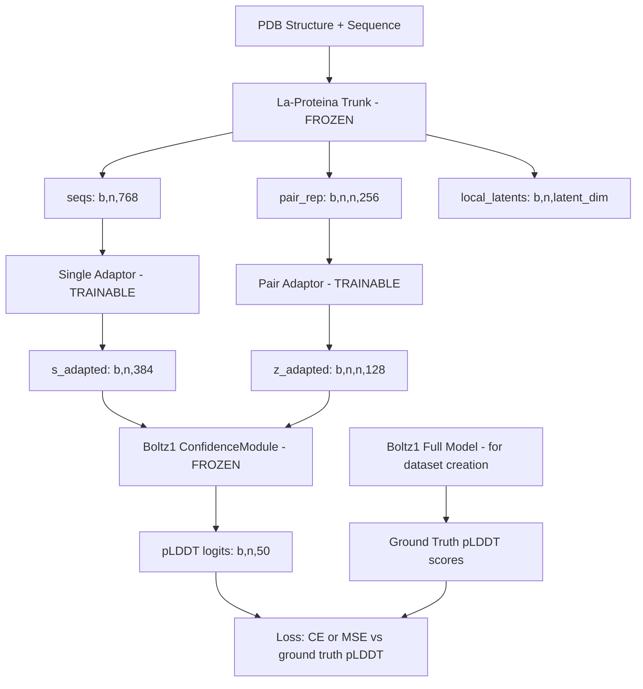
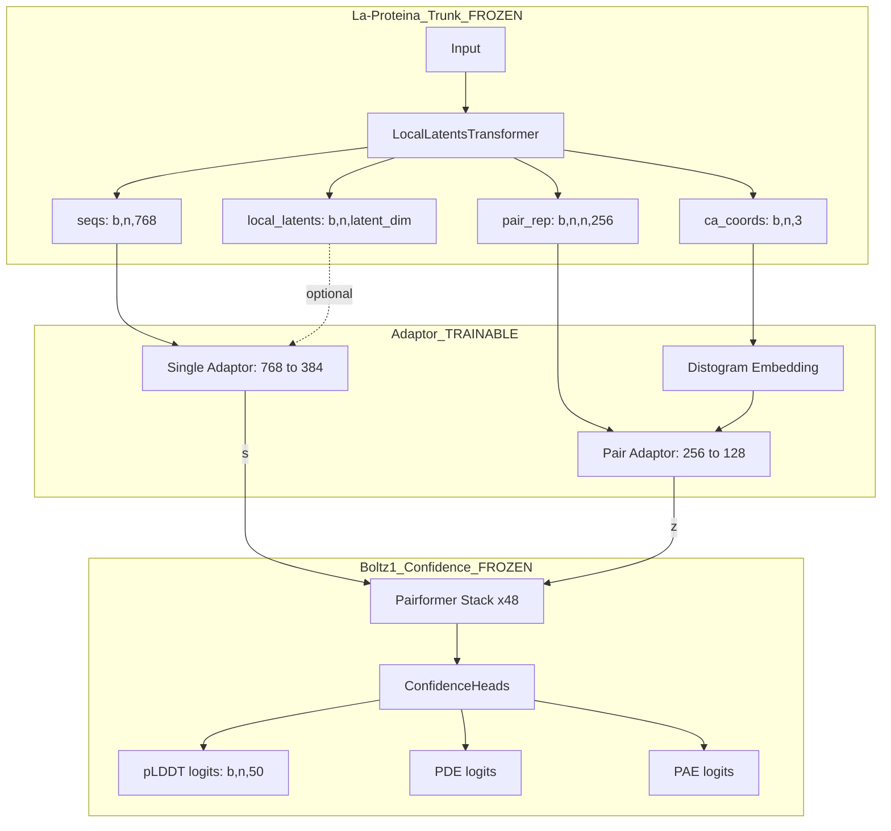

# Quality-Graft: Architecture Plan

## Overview

**Goal**: Train an attention adaptor that bridges La-Proteina's trunk representations to Boltz1's confidence head, enabling pLDDT prediction from La-Proteina features.

**Key Insight**: La-Proteina (frozen trunk) → Adaptor Layers (trainable) → Boltz1 Confidence Head (frozen) → pLDDT scores

---

## 1. Dimension Analysis

| Representation | La-Proteina (160M) | Boltz1 |
|---|---|---|
| Single/Sequence repr | `token_dim = 768` | `token_s = 384` |
| Pair repr | `pair_repr_dim = 256` | `token_z = 128` |
| Latent repr | `latent_dim` (projected from seqs) | N/A |
| Conditioning | `dim_cond = 256` | N/A |

The adaptor must bridge these dimension mismatches.

---

## 2. Data Flow Architecture



---

## 3. Proposed Repository Structure

```
quality-graft/
├── README.md
├── pyproject.toml                    # Project config, dependencies
├── environment.yaml                  # Conda environment
├── .gitignore
├── .gitmodules                       # Git submodule config
│
├── plans/
│   └── architecture.md               # This file
│
├── vendor/                           # External codebases
│   ├── la-proteina/                  # Git submodule → NVIDIA-Digital-Bio/la-proteina
│   └── boltz/                        # Git submodule → jwohlwend/boltz (for dataset gen)
│
├── configs/                          # Hydra/YAML configs
│   ├── model/
│   │   ├── adaptor.yaml              # Adaptor architecture config
│   │   └── confidence_head.yaml      # Boltz1 confidence head config
│   ├── data/
│   │   ├── dataset.yaml              # Dataset paths, splits
│   │   └── preprocessing.yaml        # Feature extraction config
│   ├── training/
│   │   └── default.yaml              # LR, optimizer, scheduler, epochs
│   └── config.yaml                   # Top-level Hydra config
│
├── src/
│   └── quality_graft/
│       ├── __init__.py
│       │
│       ├── models/                   # Core model code
│       │   ├── __init__.py
│       │   ├── adaptor.py            # Attention adaptor layers (TRAINABLE)
│       │   ├── confidence_head.py    # Extracted Boltz1 confidence module wrapper
│       │   ├── la_proteina_trunk.py  # La-Proteina trunk wrapper (FROZEN)
│       │   └── quality_graft.py      # Full assembled model (trunk + adaptor + head)
│       │
│       ├── data/                     # Data pipeline
│       │   ├── __init__.py
│       │   ├── dataset.py            # PyTorch Dataset for training
│       │   ├── datamodule.py         # Lightning DataModule
│       │   └── preprocessing.py      # Feature extraction utilities
│       │
│       ├── losses/                   # Loss functions
│       │   ├── __init__.py
│       │   └── plddt_loss.py         # pLDDT prediction loss
│       │
│       ├── utils/                    # Utilities
│       │   ├── __init__.py
│       │   ├── checkpoint.py         # Weight loading/extraction helpers
│       │   └── metrics.py            # Evaluation metrics
│       │
│       └── train.py                  # Training entry point
│
├── scripts/                          # Standalone scripts
│   ├── generate_dataset.py           # Run Boltz1 on PDBs → pLDDT labels
│   ├── extract_confidence_weights.py # Extract confidence head weights from Boltz1 ckpt
│   ├── extract_laproteina_weights.py # Prepare La-Proteina checkpoint
│   └── evaluate.py                   # Evaluation script
│
├── notebooks/                        # Exploration notebooks
│   └── exploration.ipynb
│
└── tests/
    ├── test_adaptor.py
    ├── test_data_pipeline.py
    └── test_model_assembly.py
```

---

## 4. Key Module Designs

### 4.1 Adaptor Module (`src/quality_graft/models/adaptor.py`)

The adaptor transforms La-Proteina representations into the Boltz1 confidence head's expected input space. Two design options:

**Option A: Linear Projection + Cross-Attention (Recommended)**
```
La-Proteina seqs [b,n,768] → LayerNorm → Linear(768→384) → CrossAttention(384) → s_out [b,n,384]
La-Proteina pair_rep [b,n,n,256] → LayerNorm → Linear(256→128) → z_out [b,n,n,128]
```

**Option B: Full Attention Adaptor Block**
```
La-Proteina seqs [b,n,768] → Linear(768→384) → [1-2 Transformer blocks with self-attention] → s_out [b,n,384]
La-Proteina pair_rep [b,n,n,256] → Linear(256→128) → [pair bias attention] → z_out [b,n,n,128]
```

The adaptor should be lightweight — 1-2 attention layers max — since both the trunk and head are frozen and already well-trained.

### 4.2 Confidence Head Wrapper (`src/quality_graft/models/confidence_head.py`)

Extracts and wraps the Boltz1 `ConfidenceModule` with its pretrained weights:

- Loads only the `confidence_module.*` keys from the Boltz1 checkpoint
- The module includes its own pairformer stack + `ConfidenceHeads`
- `ConfidenceHeads.to_plddt_logits(s)` produces pLDDT from single repr
- All weights frozen via `requires_grad_(False)`

**Important**: The `ConfidenceModule.forward()` expects:
- `s_inputs` — concatenated single features (token type, etc.)
- `s` — single representation from trunk
- `z` — pair representation from trunk
- `x_pred` — predicted coordinates
- `feats` — feature dict with masks, token types, etc.

We need to decide which of these to provide from La-Proteina vs. synthesize/mock.

### 4.3 La-Proteina Trunk Wrapper (`src/quality_graft/models/la_proteina_trunk.py`)

Wraps the `LocalLatentsTransformer` with frozen pretrained weights:

- Loads checkpoint from `checkpoints_laproteina/`
- Returns intermediate representations: `seqs [b,n,768]`, `pair_rep [b,n,n,256]`
- All weights frozen via `requires_grad_(False)`

**Key consideration**: The current `forward()` returns only `nn_out` dict with `bb_ca` and `local_latents`. We need to **modify the forward pass** (or subclass) to also expose the intermediate `seqs` and `pair_rep` tensors before they are projected to outputs.

### 4.4 Full Model (`src/quality_graft/models/quality_graft.py`)

```python
class QualityGraft(LightningModule):
    def __init__(self, ...):
        self.trunk = LaProteinaTrunk(...)       # FROZEN
        self.adaptor = AdaptorModule(...)        # TRAINABLE
        self.confidence_head = ConfidenceHead(...)  # FROZEN
    
    def forward(self, batch):
        # 1. Get La-Proteina representations
        seqs, pair_rep = self.trunk(batch)
        
        # 2. Adapt representations
        s_adapted, z_adapted = self.adaptor(seqs, pair_rep)
        
        # 3. Run confidence head
        plddt_logits = self.confidence_head(s_adapted, z_adapted, ...)
        
        return plddt_logits
```

---

## 5. Dataset Generation Pipeline

### Phase 1: Generate pLDDT labels using full Boltz1
1. Install Boltz1 as a pip package (`pip install boltz`)
2. For each PDB in the training set:
   - Run Boltz1 inference → get predicted structure + pLDDT scores
   - Store: `{pdb_id, sequence, plddt_per_residue, structure}`

### Phase 2: Two MSA regimes
- **Single sequence**: Use just the query sequence as a 1-row MSA
- **Full MSA**: Use precomputed MSA matrices

### Storage format
```
data/
├── processed/
│   ├── features/          # Pre-extracted La-Proteina features (optional, for speed)
│   │   └── {pdb_id}.pt
│   ├── labels/            # Boltz1 pLDDT scores
│   │   └── {pdb_id}.pt
│   └── splits/
│       ├── train.txt
│       ├── val.txt
│       └── test.txt
```

---

## 6. Dependency Management Strategy

### Git Submodules (for code access)
- `vendor/la-proteina` → fork of NVIDIA-Digital-Bio/la-proteina (pinned commit)
- `vendor/boltz` → jwohlwend/boltz (pinned commit, used for dataset generation)

### Python Path Setup
```python
# In pyproject.toml or setup.py, add vendor paths
# Or use sys.path manipulation in entry points
```

### Why submodules over pip install?
- **La-Proteina**: Not pip-installable; needs source code modifications (exposing intermediate representations)
- **Boltz1**: pip-installable for dataset generation, but we need source access to extract the confidence module architecture and weights

### Alternative: Hybrid approach
- `pip install boltz` for dataset generation scripts
- Git submodule for La-Proteina (needs source modifications)
- Copy only the confidence module files from Boltz1 into `src/quality_graft/models/boltz_modules/` (vendored subset)

---

## 7. Training Strategy

### Frozen components
- La-Proteina trunk: all parameters frozen
- Boltz1 confidence head: all parameters frozen

### Trainable components
- Adaptor layers only (~1-5M parameters depending on design)

### Loss function
- Cross-entropy on pLDDT bins (matching Boltz1's 50-bin discretization)
- Optionally: MSE on continuous pLDDT values

### Training details
- Optimizer: AdamW
- Learning rate: 1e-4 with cosine decay
- Batch size: limited by memory (pair representations are O(n^2))
- Mixed precision: bf16/fp16

---

## 8. Deep Dive: `s_inputs` and the Option A vs C Decision

### What is `s_inputs`?

After tracing through the Boltz1 code, `s_inputs` is the output of `InputEmbedder.forward()` and is constructed as:

```python
s_inputs = torch.cat([a, res_type, profile, deletion_mean, pocket_feature], dim=-1)
```

| Component | Dimension | Description |
|---|---|---|
| `a` | `token_s = 384` | Atom-level features aggregated to token level via AtomAttentionEncoder |
| `res_type` | `num_tokens` (~33) | One-hot residue type |
| `profile` | `num_tokens` (~33) | MSA profile |
| `deletion_mean` | 1 | MSA deletion mean |
| `pocket_feature` | `len(pocket_contact_info)` (~4) | Pocket contact features |
| **Total** | **`s_input_dim` ≈ 455** | |

### How `s_inputs` is used in the ConfidenceModule

With `confidence_imitate_trunk: true` and the config flags:

1. **`s_init = self.s_init(s_inputs)`** — Linear projection `s_input_dim → token_s` to initialize single repr
2. **`z_init = outer_product(s_inputs)`** — `z_init_1(s_inputs)[:, :, None] + z_init_2(s_inputs)[:, None, :]` to initialize pair repr
3. **`s = s_init + s_recycle(s_norm(s))`** — Recycled trunk `s` is added
4. **`z = z_init + rel_pos + token_bonds + z_recycle(z_norm(z))`** — Recycled trunk `z` is added
5. **`add_s_input_to_s: true`** → `s = s + self.s_input_to_s(s_inputs)` — s_inputs added again to s
6. **`add_s_to_z_prod: true`** → outer product of s_inputs added to z
7. **`add_z_input_to_z: true`** → relative position encoding + token bonds added to z
8. **`use_s_diffusion: true`** → diffusion step single repr concatenated and projected into s
9. **Distogram from `x_pred`** → pairwise distances binned and embedded into z
10. **Pairformer stack** (48 blocks, 16 heads) processes s, z
11. **ConfidenceHeads** produce pLDDT, PDE, PAE, resolved logits

### Decision: Option C — Bypass Input Embedding, Feed Adapted s,z into Pairformer

**Rationale**: 

- `s_inputs` is deeply tied to Boltz1 tokenization (atom encoder, MSA profile, residue types in Boltz1 vocabulary). La-Proteina has a completely different tokenization — it does not use Boltz1 `InputEmbedder` or `AtomAttentionEncoder`.
- Synthesizing a fake `s_inputs` would require either:
  - Running Boltz1 `InputEmbedder` on the same protein (defeats the purpose)
  - Creating a dummy `s_inputs` that the frozen linear projections would map to garbage
- **Option C** is the cleanest: the adaptor produces `s` and `z` in Boltz1 representation space, and we inject them at the point where the pairformer stack begins.

### Detailed Option C Architecture



### What we bypass vs. keep

| ConfidenceModule Component | Keep/Bypass | Reason |
|---|---|---|
| `s_init`, `z_init_1`, `z_init_2` from s_inputs | **BYPASS** | These project from s_input_dim which requires Boltz1 tokenization |
| `s_recycle`, `z_recycle` | **BYPASS** | These expect trunk s,z from Boltz1 trunk |
| `s_input_to_s` | **BYPASS** | Requires s_inputs |
| `s_to_z`, `s_to_z_transpose` | **BYPASS** | Requires s_inputs |
| `s_to_z_prod_*` | **BYPASS** | Requires s_inputs |
| `dist_bin_pairwise_embed` | **KEEP** | Can use La-Proteina C-alpha coords for distogram |
| `rel_pos` | **KEEP** optional | Relative position encoding from feats |
| `token_bonds` | **BYPASS** | Requires Boltz1 feats |
| `s_diffusion_*` | **BYPASS** | Requires diffusion step output |
| `pairformer_stack` | **KEEP** | Core of confidence prediction |
| `confidence_heads` | **KEEP** | Final prediction heads |

### Implementation: Custom Forward Pass

Instead of using `ConfidenceModule.forward()` directly, we write a custom forward that:

```python
def forward(self, s_adapted, z_adapted, ca_coords, mask):
    # s_adapted: [b, n, 384] — from adaptor
    # z_adapted: [b, n, n, 128] — from adaptor
    
    # Optionally add distogram from La-Proteina C-alpha coords
    d = torch.cdist(ca_coords, ca_coords)
    distogram = (d.unsqueeze(-1) > self.confidence_module.boundaries).sum(dim=-1).long()
    z_adapted = z_adapted + self.confidence_module.dist_bin_pairwise_embed(distogram)
    
    # Run frozen pairformer stack
    pair_mask = mask[:, :, None] * mask[:, None, :]
    s, z = self.confidence_module.pairformer_stack(
        s_adapted, z_adapted, mask=mask, pair_mask=pair_mask
    )
    
    # Final norms
    s = self.confidence_module.final_s_norm(s)
    z = self.confidence_module.final_z_norm(z)
    
    # Run confidence heads — only need s for pLDDT
    plddt_logits = self.confidence_module.confidence_heads.to_plddt_logits(s)
    
    return plddt_logits
```

### What `feats` the ConfidenceHeads need

Looking at `ConfidenceHeads.forward()`, it needs:
- `s`, `z` — from pairformer output ✓
- `x_pred` — for coordinate-based metrics (can use La-Proteina C-alpha)
- `d` — pairwise distances (computed from C-alpha)
- `feats["mol_type"]` — molecule type per token (for interface pLDDT weighting)
- `feats["token_pad_mask"]` — padding mask
- `feats["asym_id"]` — chain assignment (for interface detection)
- `pred_distogram_logits` — from trunk distogram module

For our use case, we can:
- Provide `mol_type` as all-protein (constant)
- Provide `token_pad_mask` from La-Proteina mask
- Provide `asym_id` from the PDB chain info
- Skip or mock `pred_distogram_logits` (only used for aggregated metrics, not pLDDT)

---

## 9. Adaptor-Pairformer Compatibility: Risks and Mitigations

### The Concern

The frozen pairformer stack (48 blocks, 16 heads) was trained on inputs that went through specific projections:
- `s` was initialized from `s_init(s_inputs) + s_recycle(s) + s_input_to_s(s_inputs) + s_to_z_prod(...)` 
- `z` was initialized from `z_init(s_inputs) + z_recycle(z) + rel_pos + token_bonds + distogram + s_to_z(s_inputs)`

Our adaptor will produce `s` and `z` that have never been seen by this pairformer during training. The pairformer's attention patterns, layer norms, and transition layers all have learned statistics tuned to the distribution of Boltz1's internal representations.

### Why This Can Still Work

1. **The adaptor is trainable** — It will learn to produce outputs in the distribution the pairformer expects. The adaptor's job is precisely to map La-Proteina's representation space into Boltz1's. With enough capacity (1-2 attention layers + linear projections), it can learn the right mapping.

2. **Representation spaces encode similar information** — Both models encode protein structure. La-Proteina's `seqs` and Boltz1's `s` both capture per-residue structural features. The adaptor needs to learn a *rotation/translation* in representation space, not create information from scratch.

3. **The pairformer is robust** — 48 transformer blocks with residual connections are inherently robust to input perturbations. The first few layers will "correct" any distributional mismatch, and the deep stack ensures the output converges to meaningful representations.

4. **Distogram provides grounding** — By keeping the `dist_bin_pairwise_embed` from C-alpha coordinates, we provide the pairformer with genuine structural information in exactly the format it expects. This anchors the pair representation.

### Mitigations

| Strategy | Description |
|---|---|
| **Adaptor warmup** | Start with a larger learning rate for the adaptor, then decay. This lets it quickly find the right representation space. |
| **Distribution matching loss** | Optionally add a regularization term that encourages the adaptor output distribution to match the statistics of Boltz1's internal representations (mean, variance per channel). This can be pre-computed from a few Boltz1 forward passes. |
| **Progressive unfreezing** | If the adaptor alone is insufficient, consider unfreezing the first few pairformer layers as a second training phase. This gives the pairformer a chance to adapt to the new input distribution while keeping most weights frozen. |
| **Adaptor depth** | If a simple linear projection is insufficient, increase to 2 attention blocks in the adaptor. More capacity = better distribution matching. |
| **Recycling in the adaptor** | Since we bypass the confidence module's recycling (3 steps), we could add our own recycling loop: run the adaptor → pairformer → take the pairformer's output s,z → feed back through the adaptor as additional conditioning → repeat. This mimics the original recycling behavior. |

### Recommended Approach: Start Simple, Scale Up

1. **Phase 1**: Linear projection adaptor only (768→384, 256→128). Train and evaluate.
2. **Phase 2**: If Phase 1 underperforms, add 1-2 self-attention layers in the adaptor.
3. **Phase 3**: If still insufficient, add distribution matching loss or progressive unfreezing.
4. **Phase 4**: If needed, add recycling to the custom forward pass.

---

## 10. Boltz1 v1 Confidence Config Reference

From the [confidence.yaml](https://github.com/jwohlwend/boltz/blob/main/scripts/train/configs/confidence.yaml):

```yaml
model:
  token_s: 384
  token_z: 128
  pairformer_args:
    num_blocks: 48
    num_heads: 16
    dropout: 0.25
  confidence_model_args:
    num_dist_bins: 64
    max_dist: 22
    add_s_to_z_prod: true
    add_s_input_to_s: true
    use_s_diffusion: true
    add_z_input_to_z: true
  confidence_args:
    num_plddt_bins: 50
    num_pde_bins: 64
    num_pae_bins: 64
  training_args:
    recycling_steps: 3
```

---

## 10. Resolved Design Decisions

| Decision | Choice |
|---|---|
| La-Proteina intermediate access | Subclass `LocalLatentsTransformer`, override `forward()` to expose `seqs` and `pair_rep` |
| Confidence head scope | Option C: bypass input embedding, feed adapted s,z into pairformer stack |
| Coordinate info | Use La-Proteina predicted C-alpha coords for distogram |
| Boltz1 version | v1 confidence module |
| La-Proteina representations | `seqs + pair_rep` primary; `local_latents` optional and configurable |
| Adaptor frozen/trainable | Only adaptor layers trainable; trunk and confidence head frozen |

---

## 11. Implementation Todo List

The following steps should be executed in order:

1. **Set up repo structure** — Create directory layout, pyproject.toml, configs
2. **Add La-Proteina as git submodule** — Fork and pin commit
3. **Add Boltz1 as git submodule** — Pin commit for reference and dataset generation
4. **Create La-Proteina trunk wrapper** — Subclass `LocalLatentsTransformer` to expose intermediates
5. **Extract Boltz1 confidence module** — Write weight extraction script, create standalone wrapper
6. **Implement adaptor module** — Linear projections + optional attention layers (768→384, 256→128)
7. **Implement custom confidence forward** — Bypass input embedding, wire adaptor → pairformer → heads
8. **Implement QualityGraft model** — Assemble trunk + adaptor + confidence as LightningModule
9. **Implement dataset generation pipeline** — Script to run Boltz1 on PDBs and extract pLDDT labels
10. **Implement training data pipeline** — Dataset class, DataModule, feature preprocessing
11. **Implement loss and metrics** — pLDDT cross-entropy loss, evaluation metrics
12. **Implement training loop** — Training script with configs
13. **Write tests** — Unit tests for adaptor, model assembly, data pipeline
